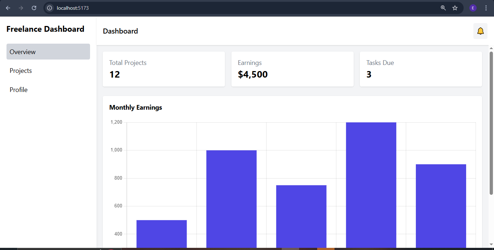
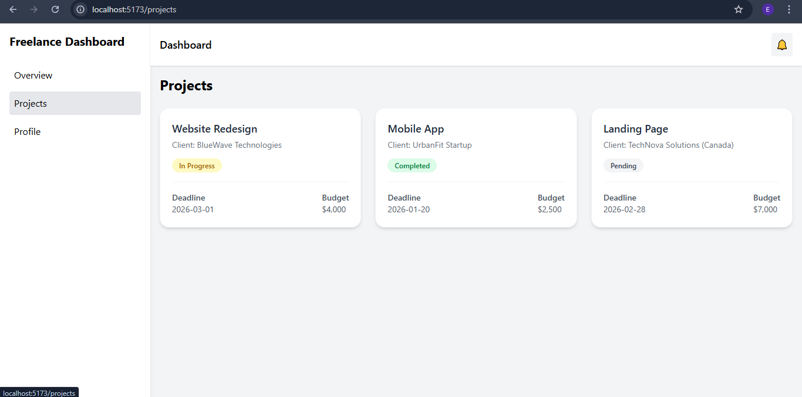
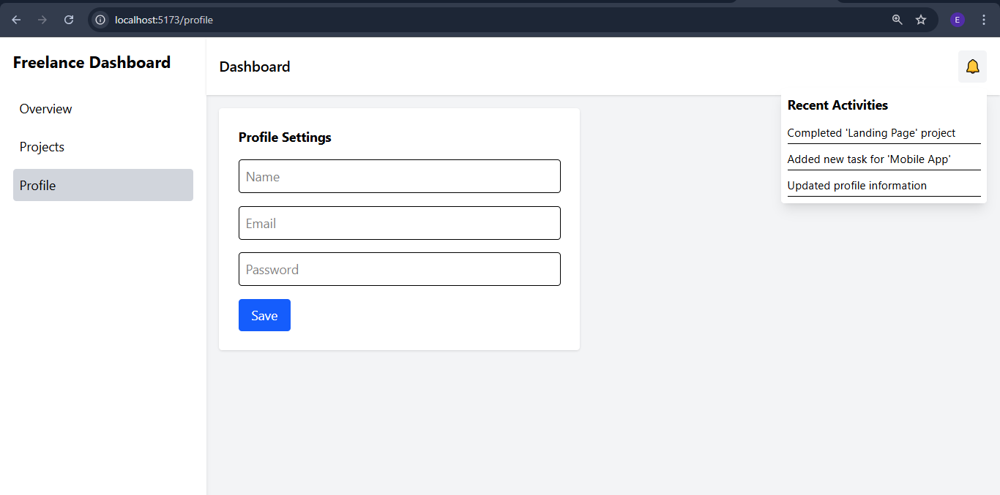

📁 Fictional Freelance Dashboard
Overview

This is a multi-page admin dashboard built for a fictional freelance client. It demonstrates:

ReactJS + React Router (multi-page navigation)

Tailwind CSS v4 (responsive design)

Chart.js (data visualization)

Reusable components and conditional rendering

Responsive and user-friendly interface for desktop and mobile

The dashboard includes the following pages:

Overview Page – Summary cards (Total Projects, Earnings, Tasks Due), recent activity list, and basic statistics charts.

Projects Page – List of client projects displayed as cards with project name, client, status, deadline, and budget.

Profile Settings Page (Optional) – View/edit profile info (name, email, password placeholders).

Bonus feature:

Notification dropdown showing the 3 most recent user activities using mock data.

🛠 Tech Stack
Technology	Purpose
React.js	Frontend framework
React Router	Multi-page navigation
Vite	Fast development server and bundler
Tailwind CSS v4	Utility-first CSS framework (responsive design)
Chart.js + react-chartjs-2	Data visualization
JavaScript	Programming language
🗂 Project Structure
dashboard-app/
├── src/
│   ├── components/
│   │   ├── Sidebar.jsx
│   │   ├── Header.jsx
│   │   ├── ProjectCard.jsx
│   │   ├── OverviewCard.jsx
│   │   ├── ChartComponent.jsx
│   │   └── NotificationDropdown.jsx
│   ├── pages/
│   │   ├── Overview.jsx
│   │   ├── Project.jsx
│   │   └── Profile.jsx
│   ├── data/
│   │   ├── Projects.js
│   │   └── Activities.js
│   ├── App.jsx
│   ├── main.jsx
│   └── index.css
├── tailwind.config.js
├── postcss.config.cjs
├── package.json
└── README.md

⚡ Features

Responsive Layout: Works on desktop and mobile devices.

Sidebar Navigation: Persistent sidebar with links to Overview, Projects, and Profile pages.

Reusable Components: ProjectCard, OverviewCard, ChartComponent, NotificationDropdown.

Dynamic Data Rendering: Mock data for projects and recent activities.

Charts: Bar chart for monthly earnings and optional pie chart for task types.

Status Badges: Color-coded project status (In Progress, Completed, Pending, Cancelled).

Notifications Dropdown: Shows 3 most recent activities dynamically.

💻 Getting Started
1. Clone the repository
git clone https://github.com/Eden1916/dashboard-app.git
cd dashboard-app

2. Install dependencies
npm install

3. Run the development server
npm run dev

Open the app in your browser:

http://localhost:5173/

⚙ Tailwind v4 Setup Notes

postcss.config.cjs must include:

module.exports = {
  plugins: {
    "@tailwindcss/postcss": {},
  },
}

index.css must contain:

@import "tailwindcss";

tailwind.config.js content paths:

export default {
  content: [
    "./index.html",
    "./src/**/*.{js,ts,jsx,tsx}",
  ],
  theme: {
    extend: {},
  },
  plugins: [],
}

🧩 Sample Mock Data
Projects (src/data/projects.js)
const projects = [
    { name: "Website Redesign",
    client: "BlueWave Technologies",
    status: "In Progress",
    deadline: "2026-03-01",
    budget: "$4,000"
    },
    { name: "Mobile App",
    client: "UrbanFit Startup",
    status: "Completed",
    deadline: "2026-01-20",
    budget: "$2,500"
    },
    { name: "Landing Page",
    client: "TechNova Solutions (Canada)",
    status: "Pending",
    deadline: "2026-02-28",
    budget: "$7,000"
    },
  ];

export default projects;

Activities (src/data/activities.js)
const activities = [
  { id: 1, message: "New project added: SaaS Dashboard"},
  { id: 2, message: "Project completed: Portfolio Website"},
  { id: 3, message: "Profile updated by user"},
];

export default activities;

📌 Available Scripts
Command	Description
npm run dev	Start Vite development server
npm run build	Build production-ready project
npm run preview	Preview production build locally
📐 Screenshots
### Overview Page

### Projects Page

### Profile Settings Page

